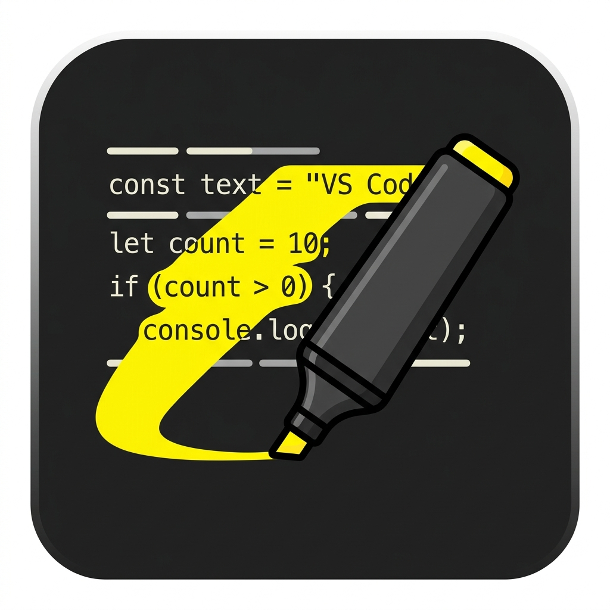
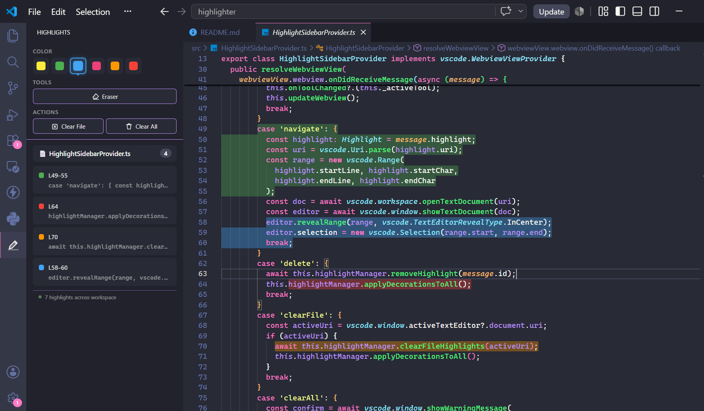
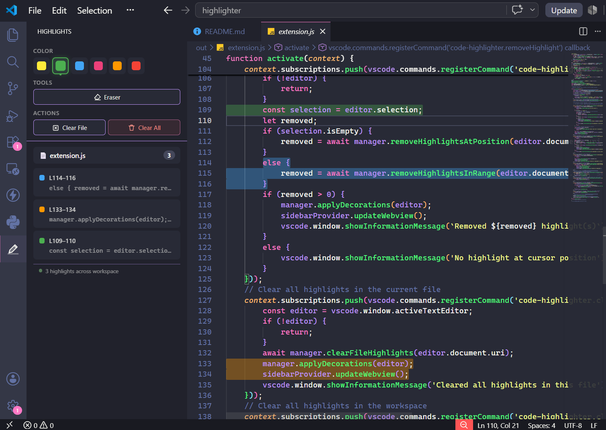

<p align="center">
  
</p>

<h1 align="center">Code Highlighter</h1>

<p align="center">
  <strong>Highlight your code with colors — just like a real highlighter pen.</strong><br/>
  Yellow, Green, Blue, Pink, Orange, Red — persistent, organized, and beautiful.
</p>

<p align="center">
  <a href="#features">Features</a> •
  <a href="#getting-started">Getting Started</a> •
  <a href="#keyboard-shortcuts">Shortcuts</a> •
  <a href="#commands">Commands</a> •
  <a href="#how-it-works">How It Works</a> •
  <a href="#contributing">Contributing</a>
</p>

---

## ✨ Features

### 🎨 Six Vivid Colors

Pick from **yellow**, **green**, **blue**, **pink**, **orange**, or **red** — each with a carefully tuned semi-transparent overlay that's easy on the eyes and works with any theme.

<p align="center">
  
</p>

### 🧰 Toolbar Sidebar

A dedicated **Activity Bar panel** gives you everything in one place:

- **Color palette** — click to select the active highlighter color
- **Eraser tool** — switch to eraser mode to remove highlights
- **Clear File** — remove all highlights in the current file
- **Clear All** — remove all highlights across the workspace
- **Highlight list** — see every highlight in the current file with line numbers and code previews

<p align="center">
  
</p>

### ⚡ Instant Keyboard Shortcut

Press **`Ctrl+Alt+H`** (or **`Cmd+Alt+H`** on Mac) and the selected text is instantly highlighted with your active color. No popups, no dialogs — just highlight and keep coding.

### 🧹 Eraser Mode

Switch to the **Eraser** in the sidebar toolbar, then:
- Place your cursor inside a highlight and press `Ctrl+Alt+H` to remove it
- Or select a range of highlighted text and press `Ctrl+Alt+H` to erase all overlapping highlights

### 💾 Persistent Highlights

Your highlights are saved per workspace and **survive across VS Code restarts**. Close VS Code, reopen your project — everything is exactly where you left it.

### ✏️ Edit-Aware

Highlights **automatically adjust** when you edit your code:
- Insert lines above a highlight → it shifts down
- Delete lines → highlights move up accordingly
- Edit within a highlighted range → the highlight is intelligently updated or removed

### 🖱️ Right-Click Menu

Right-click on selected text to see **"Highlight Selection"** in the context menu. Right-click anywhere to **"Remove Highlight at Cursor"**.

### 🔍 Click to Navigate

Click any highlight in the sidebar to **jump directly to that line** in the editor. The highlighted range is selected and scrolled into view.

---

## 🚀 Getting Started

### Install from Marketplace

1. Open VS Code
2. Go to **Extensions** (`Ctrl+Shift+X`)
3. Search for **"Code Highlighter"**
4. Click **Install**

### Install from `.vsix`

```bash
code --install-extension code-highlighter-1.0.0.vsix
```

### Quick Start

1. **Select some text** in your editor
2. Press **`Ctrl+Alt+H`** — done! The text is highlighted in yellow (the default color)
3. To change colors, click the **highlighter icon** in the Activity Bar and pick a different color
4. To erase, click **Eraser** in the toolbar, then `Ctrl+Alt+H` on highlighted text

---

## ⌨️ Keyboard Shortcuts

| Shortcut | Action |
|----------|--------|
| `Ctrl+Alt+H` | Highlight selection with active color (or erase in eraser mode) |

> 💡 **Tip:** On Mac, use `Cmd+Alt+H` instead.

---

## 📋 Commands

All commands are available via the Command Palette (`Ctrl+Shift+P`):

| Command | Description |
|---------|-------------|
| `Code Highlighter: Highlight / Erase Selection` | Highlight the selected text or erase highlights (depends on active tool) |
| `Code Highlighter: Remove Highlight at Cursor` | Remove any highlight under the cursor |
| `Code Highlighter: Clear All Highlights in File` | Remove all highlights in the current file |
| `Code Highlighter: Clear All Highlights in Workspace` | Remove every highlight across all files |

---

## 🔧 How It Works

### Highlight Storage

Highlights are stored in your **workspace state** — a per-project storage managed by VS Code. This means:
- ✅ Highlights persist across VS Code restarts
- ✅ Each project has its own independent highlights
- ✅ No files are modified — highlights are metadata only
- ✅ No cloud sync needed

### Range Tracking

Each highlight stores its exact position (start line, start character, end line, end character). When you edit your code, the extension listens to document changes and:

1. **Shifts** highlights below the edit point when lines are inserted/deleted
2. **Removes** highlights that fall within a deleted range
3. **Adjusts** highlights that partially overlap with edits

### Architecture

```
┌──────────────┐     ┌──────────────────┐     ┌─────────────────┐
│  extension.ts │────▶│ HighlightManager │────▶│ workspaceState  │
│  (commands &  │     │ (CRUD, decorate, │     │ (persistence)   │
│   events)     │     │  range tracking) │     └─────────────────┘
└──────┬───────┘     └────────┬─────────┘
       │                      │
       ▼                      ▼
┌──────────────┐     ┌──────────────────┐
│   Sidebar    │◀───▶│  VS Code Editor  │
│  (toolbar &  │     │ (decorations)    │
│   list UI)   │     └──────────────────┘
└──────────────┘
```

---

## 🎨 Highlight Colors

| Color | Preview | Use Case Ideas |
|-------|---------|----------------|
| 🟡 Yellow | `rgba(255, 235, 59, 0.35)` | Important logic, key algorithms |
| 🟢 Green | `rgba(76, 175, 80, 0.35)` | Working/approved code, good patterns |
| 🔵 Blue | `rgba(66, 165, 245, 0.35)` | References, dependencies, imports |
| 🩷 Pink | `rgba(236, 64, 122, 0.35)` | Bugs, issues, needs attention |
| 🟠 Orange | `rgba(255, 152, 0, 0.35)` | Warnings, temporary code, TODOs |
| 🔴 Red | `rgba(244, 67, 54, 0.35)` | Critical issues, deprecated code |

---

## 🛠️ Building from Source

```bash
# Clone the repository
git clone https://github.com/MihirShah07/code-highlighter.git
cd code-highlighter

# Install dependencies
npm install

# Compile TypeScript
npm run compile

# Watch mode (auto-recompile on changes)
npm run watch
```

### Testing Locally

1. Open the project folder in VS Code
2. Press **F5** to launch the Extension Development Host
3. The extension is active in the new window — try highlighting some code!

### Packaging

```bash
# Install the VS Code Extension CLI
npm install -g @vscode/vsce

# Create the .vsix package
vsce package

# Install locally
code --install-extension code-highlighter-1.0.0.vsix
```

---

## 🤝 Contributing

Contributions are welcome! Here's how to get started:

1. **Fork** this repository
2. **Create a branch** for your feature: `git checkout -b feature/my-feature`
3. **Make your changes** and test them with F5
4. **Commit** with clear messages: `git commit -m "Add: new feature"`
5. **Push** and open a Pull Request

### Ideas for Contributions

- [ ] Custom colors (let users define their own palette)
- [ ] Export/import highlights
- [ ] Highlight gutters (colored markers in the editor gutter)
- [ ] Search within highlights
- [ ] Highlight sharing between team members

---

## 📄 License

This project is licensed under the [MIT License](LICENSE).

---

<p align="center">
  Made with 🖍️ by <a href="https://github.com/MihirShah07">Mihir Shah</a>
</p>
